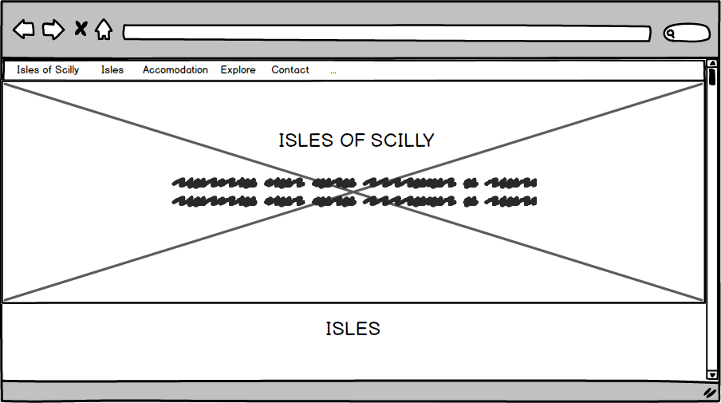
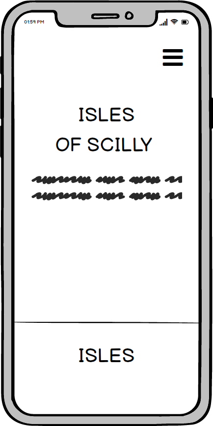
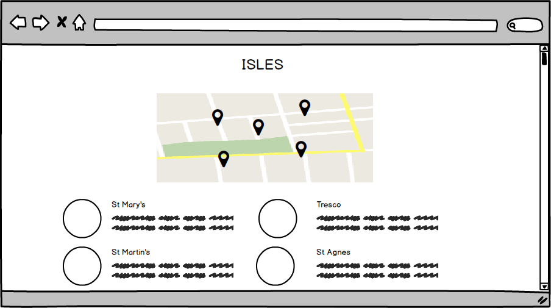
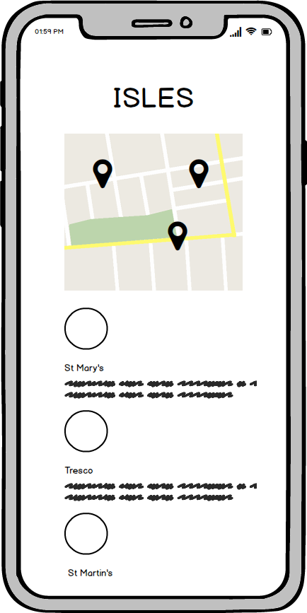
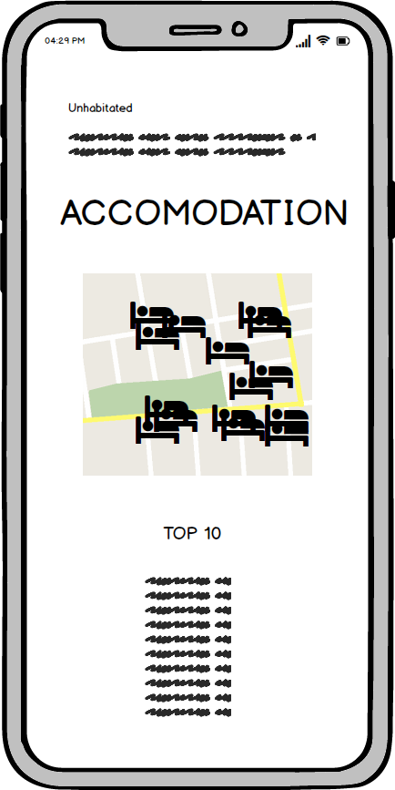
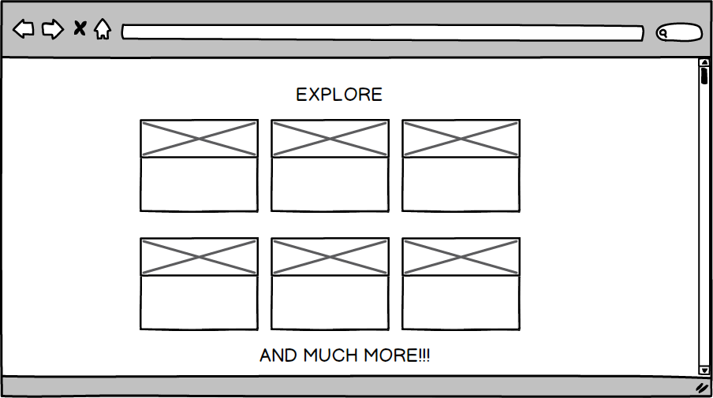
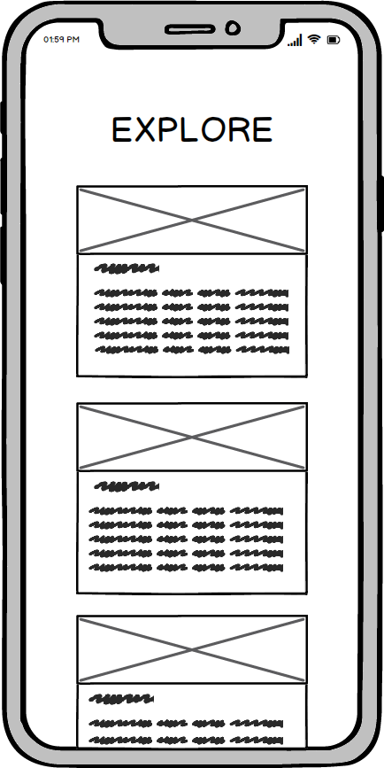
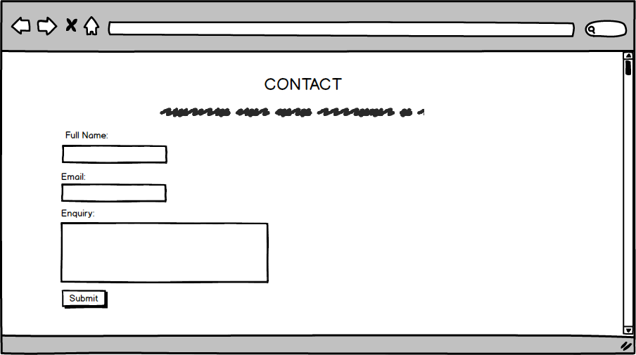

# Isles of Scilly
## Description
---
This website is for getting information about Isles of Scilly where the users can find some accomodations and activities to do on their holidays in this area of England.

I decide to make a responsive and interactive website using HTML, CSS and JavaScript for this website. Using HTML5 and CSS to make it responsive and applying  the skills learnt from the User Centric Frontend module of 
Full Stack Web Developer course from Code Institute and using JavaScript to implement some maps and make them interactive with the information provided on the website.

[My Website](https://Debbiepimpo.github.io/milestone-project-1/)

## UX
---
My goal in the design was to make information for the accomodation and activities redirecting for an extension of information and main websites to an external URL if the users wants to book in addvance or get more 
information about the hotels, activities to do or transport to travel there. 

I wanted to give a little touch of simple and seaside appearance to the website using colours such as blue, white and light orange.

All content from the main page to the media on this website were inspired by the age of the band, by listening some of their songs and I want the users being moved to an old time with the combination of colours, text style and make the pictures fit well with all this due to their vintage appearance. Every text was being resumed to make them quick and easy reading with the purpose to not get the users being bored.

This site use, one HTML file with slightly differences of design on each part to give the website a continuously appearance.
### index.html

### Isles

### Accomodation

### Explore

### Contact

## Features
---
#### Current Features
* Isles - Is a space whereby user can be introduced all the isles and where are located looking a map. All the markers are clickable and it gives the user more infromation of each isle.
* Accomodation - Is a space to find all the hotels and restaurants that are in each isle.
* Explore - Is a space on the website for the user to get info about some activities and transportation to go to the isles.
* Contact - Is a space wit a form that users can use for getting in touch and solve any queries they have.

## Technologies/Support Used
---
This is a list of technologies I have used to build out my site.
* HTML - HTML5 provided the content and the structure of my website. I tried to use semantic elements where possible to ensure the best structure.
* CSS - CSS was used to style my pages.
* [Bootstrap](https://getbootstrap.com/) - I used the Bootstrap framework alot during development. It was an efficeint way of creating the desired layout for my website. It also provided me with the possibilty to use ready made code for some parts of my website, such as the Nav bar and the contact form. I used Bootstrap to assist in building a Mobile-first approach website.
* [GitHub](https://github.com/) - This is where my repository is held externally. I will aslo use GitHub pages to deploy my website.
* [Javascript/JQuery](https://jquery.com/) - This was imported via the Bootstrap framework to enable me to create a responsive collapsible nav bar at smaller screen sizes.
* [Google Fonts](https://fonts.google.com/) - Used to import specific fonts I wanted to use on my website.
* [Font Awesome](https://fontawesome.com/) - Used website to impor icons for my social links.

## Testing
---
I have both manually and automatically tested the website throughout the development of the project. I used the web developer tools consistenly to ensure my website was responsive, firstly at mobile screen sizes, and then at larger screen sizes. I used the device feature of dev tools to test the build on all devices available.
The automatic checks of my HTML and CSS structure were done in [W3C Validator](https://validator.w3.org/#validate_by_input) to ensure there were no errors and they were both structured correctly. I did this continuously throughout the process. Additionally, to ensure that my website was responsive across different browsers, I downloaded other browsers onto my machine so I could test the build in those too. My default browser is Google Chrome which is where I did the majority of my tests. I find this the best tool to use when developing a website as I can refer to the developer tools when required. I also tested the build on Safari, Firefox, IE, Edge and Opera, although these were done periodically. Currently, the website appears and fuctions exactly as it should on all browsers, with the exception of IE and Edge (see bugs section for more details).

If there was an error on my page, I would first change the styles etc in the dev tools so i could see a live update in the browser. Once I had figured out the issue I would then go back to VS Code and make the changes there. I also tried to commit my changes as much as possible. Like the testing I did this on an ongoing basis throughout development to ensure I had lots of versions, and I could go back to a previous version should a major error occur.

Additionally to the above, I also provided my GitHub pages link to various people in order to rigorously test the website, both on mobile and desktop. I had users click on all the links in the nav on every page, and also click on all the links to the full size images on the Gallery page. Users were also asked to enter information into the contact form and ensure they were prompted to enter information into every field, as was designed with the 'required' attribute. I also posted the link to my website in the Slack to get feedback from other students in the community.

## Bugs
---

During the testing of the build I discovered that content wasnt appearing exactly as it should on both IE and Edge. I continued to build out my site whilst researching simultaneously what could be done to fix the issues I was encountering. Unfortunately, I have not been able to find any form of fix for IE. This has resulted in the gallery page not displaying any images, or any sort of format for that matter. With Edge, the gallery page isn't centered and again, I've not been able to find a fix for this yet. I beleive there is a way to target a specific browser in CSS however I've not been able to find anything yet that rectifys the issue. More research is required to rectify both of these issues. 

## Deployment
---
My website was created using VSCode. VSCode is a text editor with a built in terminal. I chose to use a text editor/IDE outside of AWS Cloud9 to gain experience working outside of a browser. Once I had created my file strcuture and first HTML page, i initiated a local repository using GIT which was downloaded onto my machine previously. I then created an external repository in GitHub and linked the local and external repositories. This allowed me to version control throughout the lifespan of the development.

* I created a new environment in VS Code
* In the bash terminal, entered 'git init'
* Created all my folders and files.
* Entered 'git add .' into the bash terminal
* Entered 'git commit' into the bash terminal and created my initial commit
* I then linked my local git repository to a GitHub repository.
* I then followed the below steps to deploy the site to GitHub pages.

To deploy the website to GitHub pages, I followed the below steps:
* Selected the milestone-project-1 from my GitHub dashboard.
* Selected 'Settings' from the menu bar.
* From the GitHub pages section, I chose 'master branch' from the dropdown menu.
* Once selected, the page refreshed and a link was displayed in the GitHub pages section to my wesbite.
* [Website Link](https://jboyd8.github.io/milestone-project-1/)

### To run this project locally

* Follow this link to the [GitHub Repositiry](https://github.com/jboyd8/milestone-project-1)
* Click on the 'Clone or Download' button.
* Copy the URL provided.
* Open a bash terminal, move to your desired directory.
* Type 'git clone' and paste in the URL.

## Credits
---
* To my mentor, [Reuben Ferrante](https://github.com/arex18), for guding me through the process and offering assistance when neccesary to point me in the right direction.
* The Slack community. The help a student is able to receive from the other students is a really great tool to have.
* [Anthony O'Brian](https://github.com/auxfuse), and [Anna Greaves](https://github.com/AJGreaves). The two leads in the User Centric Front End Slack channel during the development of my project. They provide alot of people with good quality help on a daily basis. Additionally, some of Anna's extra documentation that she has created herself came in very useful before and during development.
* [Simen Daelin](https://github.com/Eventyret), for the feedback received via the peer-code-review Slack Channel.
* [HTML Color Code](https://htmlcolorcodes.com/) - Used this website in order to obtain hex codes whilst styling my pages.
* [CSS:Hover](https://ianlunn.github.io/Hover/) - Used to import some cool animations used when hovered over a link.
* [Clip Art Mag](http://clipartmag.com/) - Used this free website to get the favicon for my website.
* [Balsamiq](https://balsamiq.com/) - Used to build out wireframes for my website.
* [W3C Validator](https://validator.w3.org/#validate_by_input) - A validator used to check my HTML and CSS structure and format periodically throughout the build.
* [W3Schools](https://www.w3schools.com/) - I used this to ensure I was entering all the information required correctly in my HTML and CSS.

#### Copied Code
As stated in the technologies used section, I used various websites to import animations and fonts etc. However, I explicitly copied code from Bootsrap for my Nav Bar and the Card Decks on the Gallery page.